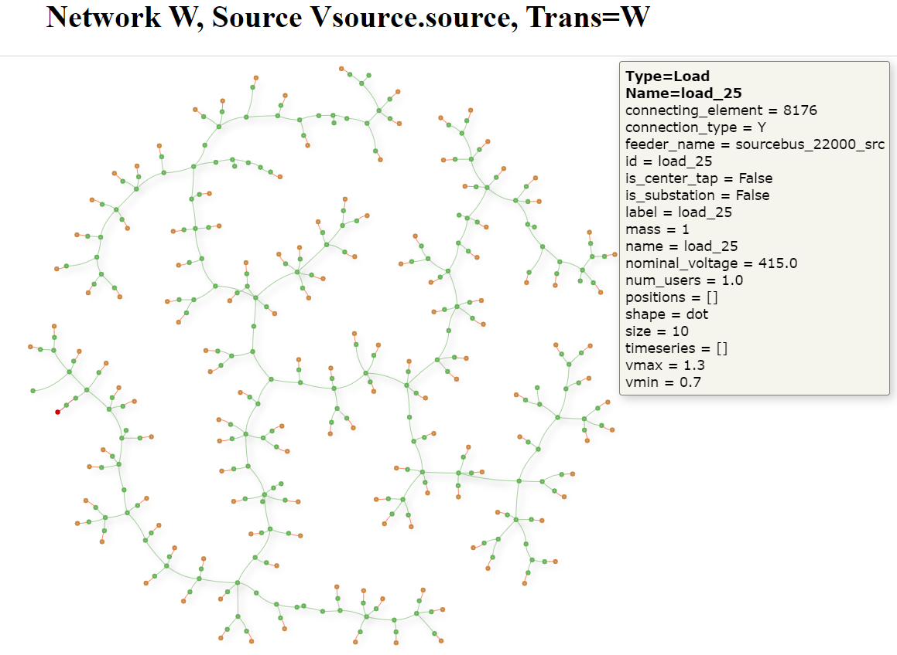

# RepresentativeLVNetworks.jl

RepresentativeLVNetworks.jl contains Julia and Python packages containing code and data outputs from CSIRO's National Low-Voltage Feeder Taxonomy (NLVFT) Study
2021, which performed clustering analysis of around 95000 low-voltage electrical distribution networks in Australia, and selected 23 'typical' networks.
See the [Final Report](https://doi.org/10.25919/2tas-7213) and [ARENA Project Page](https://arena.gov.au/projects/national-low-voltage-feeder-taxonomy-study/) for details of this analysis.

The main components of this repository are:

- The 23 representative LV networks, in OpenDSS format, in the [data](./data) folder.
- A Julia package which heavily relies on OpenDSSDirect.jl, a Julia wrapper for OpenDSS's calculation engine. (OpenDSS is an
  electrical power distribution system simulation software application, developed by the US Electric Power Research Institute.)
- The [Python package](./python-reader/readme.md) uses [Ditto](https://github.com/NREL/ditto) for OpenDSS reading, and provide some simple network rendering functionality
  and [unit tests](./python-reader/src/tests/lvft_render_test.py) for visualising the
  representative networks selected by this work.

The low voltage feeder taxonomy test case data a.k.a. the representative networks, are stored in `/data` and can be used straight away in OpenDSS. If you know how to use OpenDSS, you don't need to use
the Julia code or notebooks. For windows, you can download OpenDSS at https://www.epri.com/pages/sa/opendss. On mac/linux, you can access OpenDSS' engine through either Python or Julia wrappers:

- https://pypi.org/project/OpenDSSDirect.py/
- https://github.com/dss-extensions/OpenDSSDirect.jl

Alternatively, you can explore the power flow results of the representative networks through Pluto.jl notebooks.
Pluto.jl is a Julia package that provides a convenient, user-friendly, interactive notebook user interface to Julia. The contents of the notebook files provide guided, step-by-step, examples of
OpenDSS analysis of the LVFT `/data` files.

Example network render, see [./python-reader/output](./python-reader/output) for html renders:

## Julia Package

The Julia package contains:

- the national low voltage feeder taxonomy data set (in `/data`).
- convenience functions for working with OpenDSSDirect.jl (in `src`)
- Pluto.jl notebook files (in `notebooks`) that explore:
    1) multiperiod unbalanced power flow (in `/notebooks/multiperiod.jl`)
    2) multiperiod unbalanced power flow with PV (in `/notebooks/pvsystem.jl`)
    3) multiperiod unbalanced power flow with storage (in `/notebooks/storage.jl`)
    4) multiperiod unbalanced power flow with demand response through transformer tap changing (a.k.a. conservation voltage reduction) (in `/notebooks/cvr_load.jl`)

## Python Package

The Python package contains example Python code for reading the Low Voltage Feeder Taxonomy representative network DSS files using Ditto, converting to NetworkX graphs and rendering to HTML/PNG, and
calculating clustering
metrics.

- See [Python Readme](./python-reader/readme.md) in `./python-reader` subfolder for installation instructions.

## Julia Package Installation Instructions

We recommend using Visual studio code (an integrated development environment) to launch the notebooks, in combination with the long-term support Julia
release (1.6). To this end, ensure that the OpenDSS software has been installed, and furthermore

Install:

- Visual studio code https://code.visualstudio.com/Download
- Julia 1.6 https://julialang.org/

Install the Julia plug-in for VSCode: https://www.julia-vscode.org/docs/dev/gettingstarted/#Installation-and-Configuration-1

Installation instructions for RepresentativeLVNetworks.jl

1) Unzip the file downloaded from NEAR (http://linked.data.gov.au/dataset/energy/f325fb3c-2dcd-410c-97a8-e).
2) Browser in VSCode to the root of the unzipped folder.
3) Open a Julia terminal within VSCode. E.g. menu "view" -> "command pallete" and type "Julia start REPL". Press enter. This provides you with the Julia "REPL" green prompt julia>,
   see https://docs.julialang.org/en/v1/stdlib/REPL/
4) If you type `pwd() [enter]` at the `julia>` prompt you should see the path of the unzipped folder.
5) type: `include("script/initial_setup.jl") [enter]` to set up the Julia environment needed to launch the RepresentativeLVNetworks package (other dependent packages). The establishment of the Julia
   environment may take some minutes.
6) To confirm the successful setup of the environment, typing
   `using Pkg; Pkg.status() [enter]` at the `julia>` prompt in the terminal window should return
   a) the Project name "RepresentativeLVNetworks" and version number
   b) the label "Status" followed by the path of a `Project.toml` file, and
   c) a list of [8 hexadecimal digits within square braces], labels of installed packages, and version numbers.

Running the notebooks of RepresentativeLVNetworks.jl

1) Open a Julia terminal within VSCode. E.g. menu "view" -> "command pallete" and type "Julia start REPL". Press enter.
2) In the VSCode file browser, go to the `/notebooks` folder and choose a notebook to run, e.g. `multiperiod.jl` (see section Package contents above) and right-click to "copy path".
3) Type: `include("script/pluto_launch.jl") [enter]` to launch Pluto.jl. This should launch a browser with a webpage stating "Welcome to Pluto".
4) In the 'open from file' text box, paste the copied notebook path and click 'open'. This will launch the selected notebook.
5) Julia will now just-in-time compile a lot of code, which means you'll have to wait about 3 minutes before the notebook becomes interactive.
6) Each notebook (`multiperiod.jl`, `pvsystem.jl`, `storage.jl`, and
   `cvr_load.jl`) contains a dropdown box to select the network (a letter between A and W) and a button "generate figures". You need to press this button every time you change the network selection.
   This triggers the notebook to update the OpenDSS calculations and figures. In each notebook, there are sliders and tickboxes to finetune the simulation. Generally, you'll also need to press "
   generate figures" after any change of the sliders/tickboxes.

Figures are stored in `data/csv_results`.

## Resources

You can ask for generic Julia help on discourse (https://discourse.julialang.org/)
The JuliaLang youtube channel also contains tutorials (https://www.youtube.com/c/TheJuliaLanguage)

## Publications

This code is the result of a research project. See below for links to the final report and other publications describing it and its results.

## Referencing

If referencing this work, please cite as:

`Geth, Frederik; Brinsmead, Thomas; West, Sam; Goldthorpe, Peter; Spak, Brian; Cross, Gavin; Braslavsky, Julio. National Low-Voltage Feeder Taxonomy Study. Newcastle: CSIRO; 2021. https://doi.org/10.25919/2tas-7213`

### Lessons learnt presentation

This presentation covers the Challenges and opportunities of the digital electric grid and Lessons learnt from the CSIRO National Low-Voltage Feeder Taxonomy Study. The presentation focuses on the
LVFT project context, aims and achievements, final report highlights, lessons learnt and future directions.

- Slides http://linked.data.gov.au/dataset/energy/15d42cd5-dc72-449a-9ff2-7a2561830233
- Video recording http://linked.data.gov.au/dataset/energy/1038ac62-633f-4234-9284-f7ea0ca2b22c

### Methodology and power flow illustrations presentation

- This presentation explains the Low-Voltage representative models and notebooks that have been developed as part of the CSIRO Low-Voltage Feeder Taxonomy study.
- Video recording http://linked.data.gov.au/dataset/energy/1038ac62-633f-4234-9284-f7ea0ca2b22c

## License

See [LICENSE](LICENSE) for this software's license terms. If using this software, you must abide by this license agreement.

## Third Party Licenses

For a list of licenses for libraries required by this code, see:

- Julia code: [THIRD_PARTY_LICENSES.csv](THIRD_PARTY_LICENSES.csv)
- Python code: [THIRD_PARTY_LICENSES.md](python-reader/THIRD_PARTY_LICENSES.md)

## Acknowledgements

This work received funding from ARENA, the Australian Renewable Energy Agency. The views expressed herein are not necessarily the views of the Australian government, and the Australian government does
not accept responsibility for any information or advice contained herein.

CSIRO contributors to this package include:

- Matt Amos
- Thomas Brinsmead
- Frederik Geth
- Rahmat Heidarihaei
- Sam West

